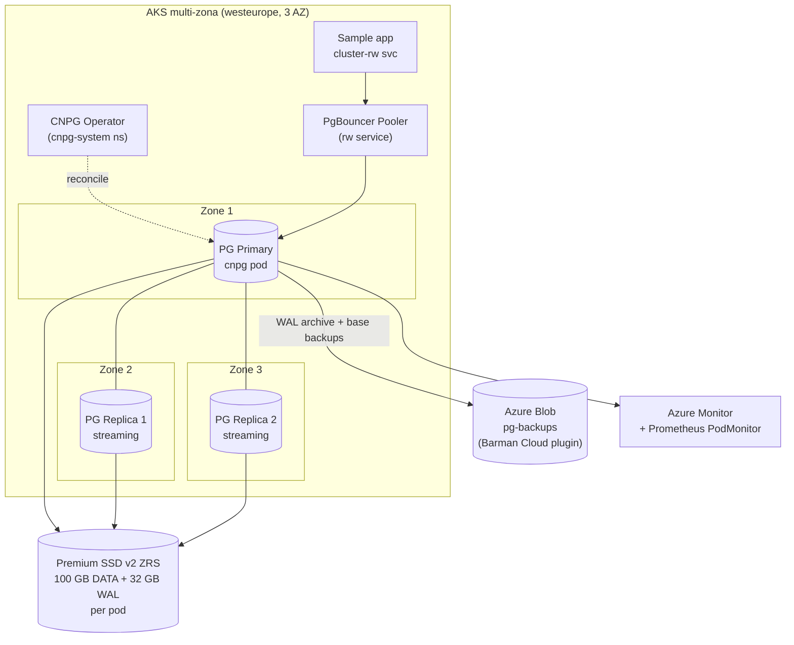

# poc-postgresql-ha-aks-cnpg

> **🌐 Public release** — generic CloudNativePG PoC for Azure Kubernetes Service. Resource names, namespaces, and demo data have been genericized. Adapt naming and identifiers to your environment before running.


> PostgreSQL High Availability sobre AKS usando el operador **CloudNativePG (CNPG) 1.28** — multi-AZ, Premium SSD v2, backups a Azure Blob, demo de failover y benchmarking. Alternativa "PaaS-like" autogestionada a Azure Database for PostgreSQL Flexible Server.
> Pensado para una sesión técnica con **Demo** mostrando un patrón Microsoft-soportado (referencia [MS Learn AKS PostgreSQL HA](https://learn.microsoft.com/en-us/azure/aks/postgresql-ha-overview)).

---

## 🚀 Quickstart (5 comandos)

```bash
git clone https://github.com/aofvalley/postgresql-ha-aks-cnpg.git
cd postgresql-ha-aks-cnpg
cp .env.example .env && $EDITOR .env       # rellena SUBSCRIPTION_ID y prefijos
make infra                                  # despliega RG + AKS multi-zona + Storage
make cnpg && make cluster                   # operador + cluster PG HA + backup schedule
```

Cuando termine `make cluster`, el cluster está listo y puedes probar:

```bash
make demo-failover         # promueve réplica y mide RTO
make demo-backup           # dispara backup y restaura como cluster nuevo
make demo-perf             # pgbench dentro del cluster
make demo-cross-cluster    # streaming + promote en AKS secundario
make demo-interop          # pg_dump/pg_restore Flex Server ↔ CNPG (bidireccional)
make demo-connect          # imprime creds + comando port-forward para clientes externos (VS Code / psql / DBeaver)
make demo-connect-forward  # idem + arranca port-forward en esta shell
make clean                 # az group delete --yes
```

> `demo-interop` requiere un Azure Database for PostgreSQL Flexible Server alcanzable con tu cuenta AAD admin. Configura `FLEX_*` y `INTEROP_DB` en `.env` (ver `.env.example`).
>
> `demo-connect` extrae user/pass/db del secret `<cluster>-app` y muestra los parámetros listos para pegar en cualquier cliente Postgres. Override de servicio con `TARGET=ro|r|pooler` (default `rw`). Override de puerto local con `LOCAL_PORT=15432` (útil si tienes Postgres local instalado en `5432`).

---

## 🏛️ Arquitectura



- **AKS**: 1 system pool `Standard_D8ds_v5` + 1 user pool `Standard_D16ds_v5` distribuido en 3 zonas, OIDC issuer + Workload Identity habilitados, Azure Monitor + Log Analytics.
- **CNPG cluster**: 3 instancias (1 primary + 2 standby streaming síncrono opcional), pod anti-affinity por zona, separación volumen DATA y WAL.
- **Storage**: Premium SSD v2 ZRS (StorageClass con `WaitForFirstConsumer` + `allowVolumeExpansion`).
- **Backups**: Barman Cloud Plugin → Azure Blob container `pg-backups`. ScheduledBackup diario + WAL streaming continuo (RPO bajo).
- **Observabilidad**: PodMonitor para Prometheus (puerto 9187, exporter incorporado en CNPG).

---

## 📋 Prerequisites

| Tool | Min version | Comprobación |
|---|---|---|
| Azure CLI | 2.56+ | `az version` |
| kubectl | 1.28+ | `kubectl version --client` |
| Helm | 3.12+ | `helm version` |
| jq | 1.5+ | `jq --version` |
| krew | latest | `kubectl krew version` |
| cnpg plugin | 1.24+ | `kubectl cnpg version` |

Ejecuta `bash scripts/00-prereqs.sh` para verificación automática.

> **Tenant demo:** `demo-admin@example.com` (tenant `00000000-0000-0000-0000-000000000000`) · región `westeurope` · prefijo RG `rg-pgha-demo-`.

---

## 💾 Storage choice matrix

| Eje | **Premium SSD v2 (ZRS)** | **Local NVMe + Azure Container Storage** |
|---|---|---|
| VM family demo | `Standard_D16ds_v5` | `Standard_L16s_v3` (NVMe local) |
| Disponibilidad de datos | Replicado a 3 zonas (ZRS) — superviven caídas de zona | Local al nodo; CNPG replica a otra réplica en otra zona |
| Latencia típica | ~7.4 ms p95 | ~4.3 ms p95 |
| TPS pgbench (ref Azure blog) | ~8.600 TPS | ~14.812 TPS |
| Coste relativo | Medio (~€0.10/GB/mes + IOPS) | Bajo (incluido en VM) pero VM más cara |
| Cuándo elegir | Default seguro, durable, snapshots Azure-native | Workloads write-heavy, latencia crítica, OK con réplicas como mecanismo de durabilidad |

Referencia oficial de números: [Running high-performance PostgreSQL on AKS](https://azure.microsoft.com/en-us/blog/running-high-performance-postgresql-on-azure-kubernetes-service/) (Azure blog).

> Esta PoC usa **Premium SSD v2 ZRS** por defecto (storage class en `manifests/02-storage-class.yaml`). Para cambiar a Local NVMe + ACStor, sigue las notas en [`docs/architecture.md`](./docs/architecture.md#variante-local-nvme--acstor).

---

## 🎬 Demo flows

| Flujo | Script | Qué demuestra |
|---|---|---|
| Failover | [`scripts/10-demo-failover.sh`](./scripts/10-demo-failover.sh) | Promoción manual con `kubectl cnpg promote`, medición RTO con timestamps |
| Backup + restore | [`scripts/11-demo-backup.sh`](./scripts/11-demo-backup.sh) | On-demand `Backup` CR → verificación en Blob → restore como cluster nuevo |
| Perf (pgbench) | [`scripts/12-demo-perf.sh`](./scripts/12-demo-perf.sh) | `pgbench -i -s 50` + `pgbench -c 16 -T 60` reportando TPS y latencia |
| Cross-cluster | [`scripts/13-demo-cross-cluster.sh`](./scripts/13-demo-cross-cluster.sh) | Replica Cluster cross-AKS + promote, medición RTO |
| Interop bidireccional | [`scripts/14-demo-interop-bidir.sh`](./scripts/14-demo-interop-bidir.sh) | `pg_dump`/`pg_restore` Flex Server ↔ CNPG (passwordless AAD + secret operator) |
| Conexión externa | [`scripts/15-demo-connect.sh`](./scripts/15-demo-connect.sh) | Extrae creds del secret `<cluster>-app` + port-forward (rw/ro/r/pooler) para VS Code / psql / DBeaver. Override `LOCAL_PORT=15432` si `5432` ocupado |

Runbooks paso a paso:
- [`docs/runbook-failover.md`](./docs/runbook-failover.md)
- [`docs/runbook-backup-restore.md`](./docs/runbook-backup-restore.md)
- [`docs/runbook-interop.md`](./docs/runbook-interop.md)

---

## 💶 Cost ballpark (no-prod)

| Componente | Cantidad | Coste mensual aprox. (West Europe, PAYG) |
|---|---|---|
| AKS user pool `Standard_D16ds_v5` | 3 nodos | ~€480 |
| AKS system pool `Standard_D8ds_v5` | 2 nodos | ~€140 (sólo se cobran las VMs) |
| Premium SSD v2 ZRS — 100 GB DATA × 3 + 32 GB WAL × 3 | ~400 GB | ~€55 |
| Storage Account (LRS) backups + WAL archive | ~50 GB | ~€2 |
| Log Analytics + Azure Monitor | bajo volumen | ~€20 |
| **Total estimado** | | **~€700/mes** |

> Cifras orientativas, sin descuentos (RI/Savings Plan). Para producción real añadir CMK, private cluster, NAT gateway dedicado, etc.

---

## 🧹 Cleanup

```bash
make clean
```

Elimina el resource group completo (`az group delete --yes --no-wait`).

---

## 📚 Vault delivery

La documentación de cliente, narrativa de sesión y screenshots viven en el vault:

```
your-internal-knowledge-base/postgresql-ha-aks-cnpg/
```

Este repo contiene únicamente el **scaffold ejecutable**. La narrativa para Demo (objetivos, agenda de demo, próximos pasos) se mantiene en el vault.

---

## 🗂️ Estructura del repo

```
poc-postgresql-ha-aks-cnpg/
├── README.md
├── .env.example
├── .gitignore
├── Makefile
├── infra/                # Bicep AKS multi-AZ + Storage
├── manifests/            # CNPG operator install + Cluster CR + backups + monitoring
├── scripts/              # bootstrap + demos + cleanup
├── docs/                 # arquitectura + runbooks
└── troubleshooting/      # issues comunes
```

---

## 🔗 Referencias

- [MS Learn — AKS PostgreSQL HA overview](https://learn.microsoft.com/en-us/azure/aks/postgresql-ha-overview)
- [MS Learn — Deploy CNPG on AKS](https://learn.microsoft.com/en-us/azure/aks/deploy-postgresql-ha?tabs=azuredisk)
- [Azure blog — High-performance PostgreSQL on AKS](https://azure.microsoft.com/en-us/blog/running-high-performance-postgresql-on-azure-kubernetes-service/)
- [CloudNativePG 1.28 docs](https://cloudnative-pg.io/docs/1.28/)
- [Barman Cloud Plugin (CNPG)](https://github.com/cloudnative-pg/plugin-barman-cloud)
