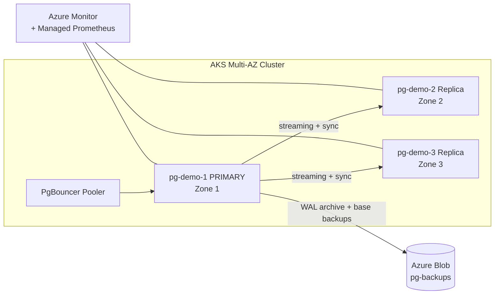

# Architecture — PostgreSQL HA on AKS with CloudNativePG

## 1. Goals

| Requirement | Target |
|---|---|
| Availability | 99.95% (multi-AZ within a single region) |
| RPO | ≤ 5 min via WAL archiving to Azure Blob |
| RTO | < 30 s on planned failover, < 60 s on node loss |
| Scalability | 1 primary + 2 hot-standby replicas, vertical & horizontal |
| Backup retention | 30 days (PITR), GFS for monthly long-term |
| Manageability | 100% declarative (Bicep + Kubernetes CRs) |

## 2. Topology

```
                                        Azure Region: West Europe
+--------------------------------------------------------------------------------+
|                                                                                |
|   AKS cluster aks-pgha-demo (k8s 1.30, OIDC + Workload Identity)            |
|                                                                                |
|   +----------- Zone 1 ------------+  +----------- Zone 2 ------------+         |
|   | systempool (D8ds_v5)           |  | systempool (D8ds_v5)         |         |
|   | pgpool node (D16ds_v5)         |  | pgpool node (D16ds_v5)       |         |
|   |   pg-demo-1 (PRIMARY)       |  |   pg-demo-2 (REPLICA)     |         |
|   |   PVC 100Gi data + 32Gi WAL    |  |   PVC 100Gi data + 32Gi WAL  |         |
|   |   Premium SSD v2 ZRS           |  |   Premium SSD v2 ZRS         |         |
|   +-------------------------------+  +------------------------------+          |
|                                                                                |
|                       +----------- Zone 3 ------------+                        |
|                       | systempool (D8ds_v5)          |                        |
|                       | pgpool node (D16ds_v5)        |                        |
|                       |   pg-demo-3 (REPLICA)      |                        |
|                       |   PVC 100Gi data + 32Gi WAL   |                        |
|                       +-------------------------------+                        |
|                                                                                |
|   PgBouncer Pooler (3x rw)  --> Service pg-demo-rw (k8s ClusterIP)          |
|                                                                                |
+--------------------------------------------------------------------------------+
                                |
                                | Workload Identity (OIDC fed cred)
                                v
                  +----------------------------+
                  | Azure Blob (StorageV2 LRS) |
                  |   container: pg-backups    |
                  |   versioning + soft-delete |
                  +----------------------------+
```



## 3. Storage decision matrix

| Option | Use case | Pros | Cons |
|---|---|---|---|
| **Premium SSD v2 (ZRS)** ← default | Production HA across zones | Independent IOPS/throughput, ZRS resiliency, online expansion | No host-cache, slightly higher latency vs Local NVMe |
| Premium SSD v1 (LRS) | Cost-sensitive, single AZ | Mature, host-cached | Coupled IOPS/size, no ZRS for largest sizes |
| **Local NVMe + Azure Container Storage (ACStor)** | Max performance, latency-sensitive (e.g. analytics replicas) | 14k+ TPS, sub-5ms p95 | Ephemeral disks → must rely on CNPG replication for durability |
| Azure Files NFS | Not recommended | — | High latency, not suitable for PG WAL |

**Decision:** Premium SSD v2 ZRS for all instances. Future tiering option = Local NVMe ACStor for read replicas only.

## 4. Failover behaviour

CNPG uses Patroni-like leader election via the operator. Failover triggers:

1. **Planned promotion** (`kubectl cnpg promote`): clean shutdown of primary, immediate promotion of selected replica. Expected RTO ≈ **5–15 s**.
2. **Node loss / pod crash**: operator detects unhealthy primary in ~10s, promotes lowest-lag replica. RTO ≈ **20–40 s**.
3. **Zone outage**: PVC re-attaches in surviving zone; CNPG promotes a replica that is already running there. ZRS storage means data is intact.

Clients reconnect through the `pg-demo-rw` service (always points to current primary) — no DNS change needed.

## 5. Backup & restore

- **WAL archive**: continuous WAL streaming to `pg-backups/<cluster>/wals/`
- **Base backup**: ScheduledBackup CR runs daily at 02:00 UTC
- **PITR**: any second within retention window
- **Auth**: Azure AD via Workload Identity (federated credential between AKS OIDC issuer and the user-assigned MI `mi-<storage>-backup`)
- **Restore**: declarative — create a new `Cluster` CR with `bootstrap.recovery.source` referencing an `externalCluster` pointing at the same `barmanObjectStore`

## 6. Observability

- Cluster-wide Container Insights (Log Analytics)
- Managed Prometheus scrapes the CNPG `metrics` endpoint via PodMonitor
- Key metrics: `cnpg_pg_replication_lag`, `cnpg_pg_wal_lag_bytes`, `cnpg_backends_total`, `cnpg_collector_last_failed_backup`

## 7. Security posture

- Pod Security Standards: `baseline` on `pg-demo`, `privileged` on `cnpg-system`
- No PG superuser secret committed; CNPG generates and rotates via the `Cluster` CR
- Backup credentials = Workload Identity (no storage account keys)
- Network: AKS uses Azure CNI Overlay; Storage Account public for the PoC, swap to private endpoint for production
